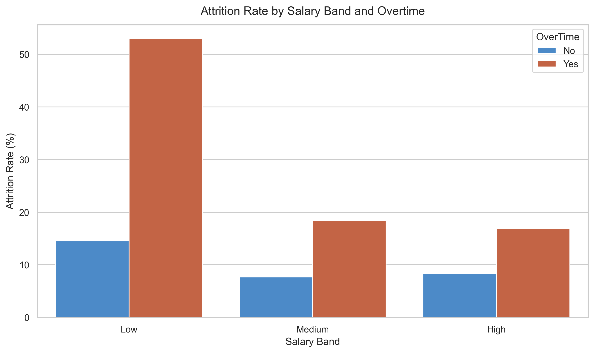
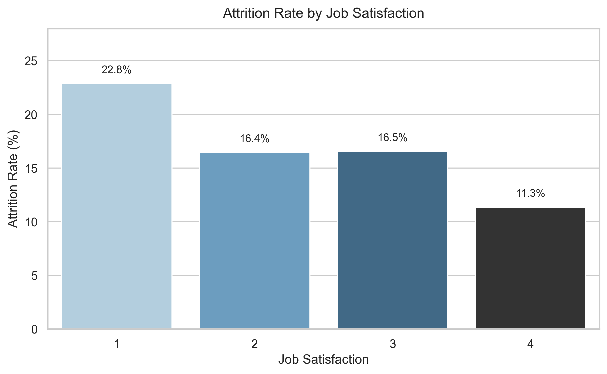
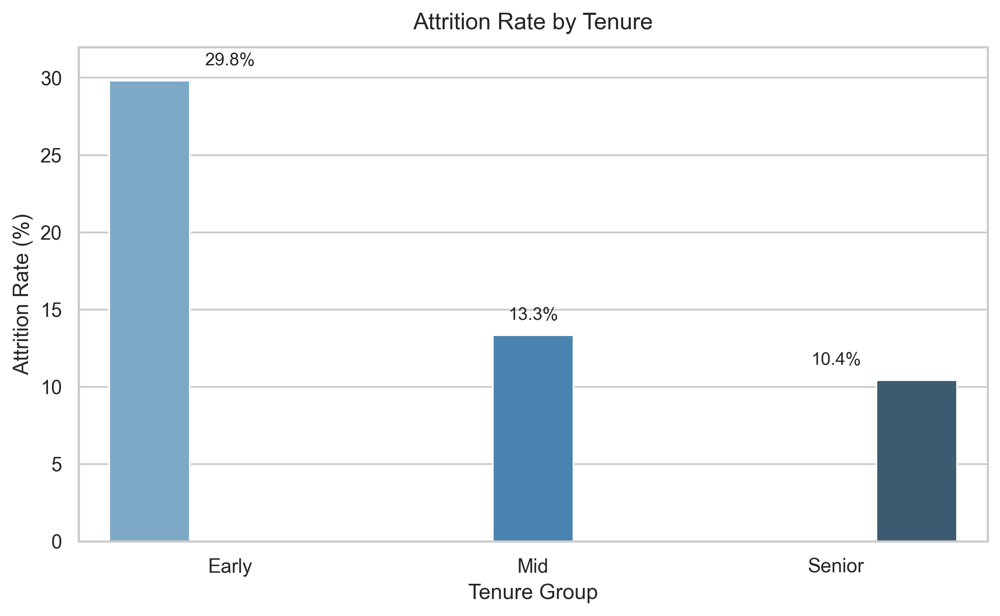

# 📊 Employee Attrition Analysis

> Exploratory analysis of the key drivers behind employee turnover, using salary, overtime, department, job satisfaction, and tenure as primary dimensions.

---

## 🔍 Overview

This project investigates the factors associated with employee attrition using HR data. The goal is to identify patterns and risk segments that can inform retention strategies and support data-driven decision-making in People Analytics.

The analysis was conducted in Python and SQL, covering five analytical dimensions: salary band, overtime, department, job satisfaction, and tenure.

---

## 📁 Project Structure

```
├── notebooks/
│   └── attrition_analysis.ipynb   # Main analysis notebook
├── data/
│   └── raw/
│       └── employees.csv          # Source dataset
├── images/
│   ├── attrition_salary_overtime.png
│   ├── attrition_job_satisfaction.png
│   └── attrition_tenure.png
├── sql/
│   └── hr_attrition_queries.sql
└── README.md
```

---

## ⚙️ Setup

**Requirements:** Python 3.8+

Install dependencies:

```bash
pip install pandas matplotlib seaborn
```

Run the notebook:

```bash
jupyter notebook notebooks/attrition_analysis.ipynb
```

---

## 🛠️ Methodology

### Feature Engineering

Three features were derived from the raw dataset::

| Feature | Description |
|---|---|
| `Exited` | Binary encoding of `Attrition` (`Yes → 1`, `No → 0`) |
| `SalaryBand` | Three-tier income bucket: **Low** (≤ $4k), **Medium** ($4k–$7k), **High** (> $7k) |
| `TenureGroup` | Career stage bucket: **Early** (≤ 2 yrs), **Mid** (3–7 yrs), **Senior** (> 7 yrs) |

---

## 📈 Key Findings

### 1. Salary + Overtime → Highest Risk Combination
Employees in the **low salary band who work overtime** exhibit the highest attrition rates across all groups. Higher salaries partially mitigate this effect, but overtime consistently increases attrition across all compensation tiers.

### 2. Overtime Alone Is a Strong Predictor
Employees who work overtime show significantly higher turnover rates compared to those who don't — suggesting that workload management is a critical lever for retention.

### 3. Sales and HR Are the Most Vulnerable Departments
The **Sales** department presents the highest attrition rate, consistent with its high-pressure environment. **Human Resources** follows closely, warranting further investigation into internal engagement and role clarity in that function.

### 4. Job Satisfaction Has a Clear Inverse Relationship with Attrition
Employees with the lowest job satisfaction levels have notably higher attrition rates. The gap is most pronounced between the extremes (satisfaction levels 1 vs. 4), while mid-level groups behave similarly.

### 5. Early Tenure Is the Most Critical Retention Window
Employees in their **first two years** at the company show significantly higher attrition. Rates decrease steadily as tenure increases, indicating that onboarding quality and early engagement are decisive factors.

---

## 🗄️ SQL Analysis

All analytical dimensions were also reproduced using SQL (SQLite) to validate and cross-check the results obtained with Pandas.

| Query # | Dimension |
|---|---|
| 1 | Attrition by Salary Band |
| 2 | Attrition by Overtime |
| 3 | Salary Band × Overtime (main insight) |
| 4 | Attrition by Department |
| 5 | Attrition by Job Satisfaction |
| 6 | Attrition by Tenure |

- Queries are available in [`sql/hr_attrition_queries.sql`](./sql/hr_attrition_queries.sql)
- Executed inside the notebook via an in-memory SQLite database (`sqlite3` + `pd.read_sql`)
- Results are consistent with the Pandas analysis across all dimensions

---


## 📊 Visual Analysis

### Salary Band vs Overtime



---

### Job Satisfaction



---

### Tenure



---

## 🧰 Tech Stack

| Tool | Purpose |
|---|---|
| `pandas` | Data wrangling and aggregation |
| `matplotlib` | Base plotting layer |
| `seaborn` | Statistical visualizations |
| `sqlite3` | In-memory database for SQL validation |

---

## 🚀 Potential Next Steps

- Build a **predictive model** (logistic regression, random forest) to score attrition risk by employee
- Conduct **multivariate analysis** combining salary, overtime, and satisfaction simultaneously
- Add **statistical significance tests** to validate observed differences between groups
- Integrate with HR dashboards for real-time monitoring

---

## 👤 Author

Feel free to reach out or connect:

- **GitHub:** [joaolouzada12](https://github.com/joaolouzada12)
- **LinkedIn:** [João Louzada](https://www.linkedin.com/in/jo%C3%A3o-louzada-402503219/)

---

*Dataset: IBM HR Analytics Employee Attrition & Performance (or equivalent)*
